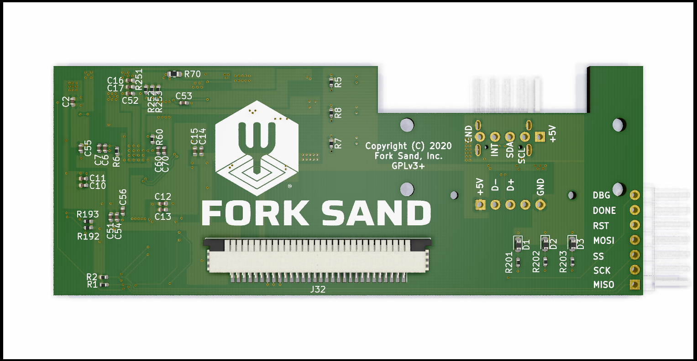
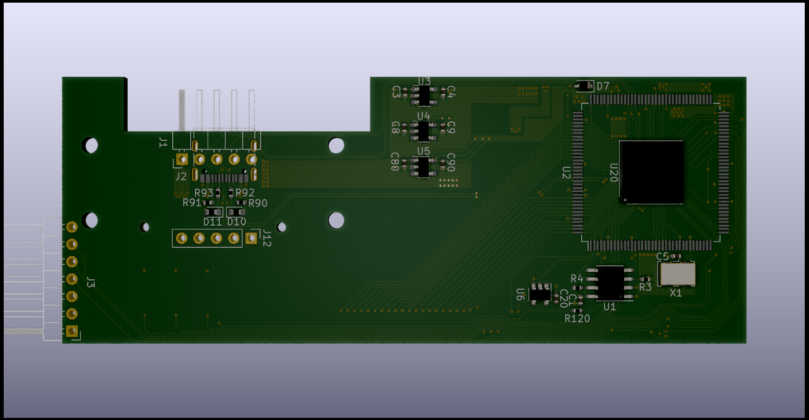

View this project on [CADLAB.io](https://cadlab.io/project/23397). 

# WASD-libre-8K

FPGA-based keyboard controller

## Goal Features
 - open-source firmware and toolchain
 - QMK-compatibility (patches are planning)
 - WASD-keyboard compatibility
 - Mechanical compatibility with existing popular 80% keyboards (i.e XD87 from KRepublic)
 - controlling keyboard backlight
 - controlling keyboard RGB-highlight
 - I2C (ready) and USB (planning) interfaces
 
 The work is in progress...